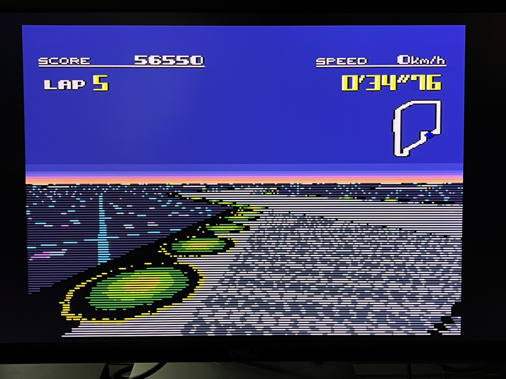
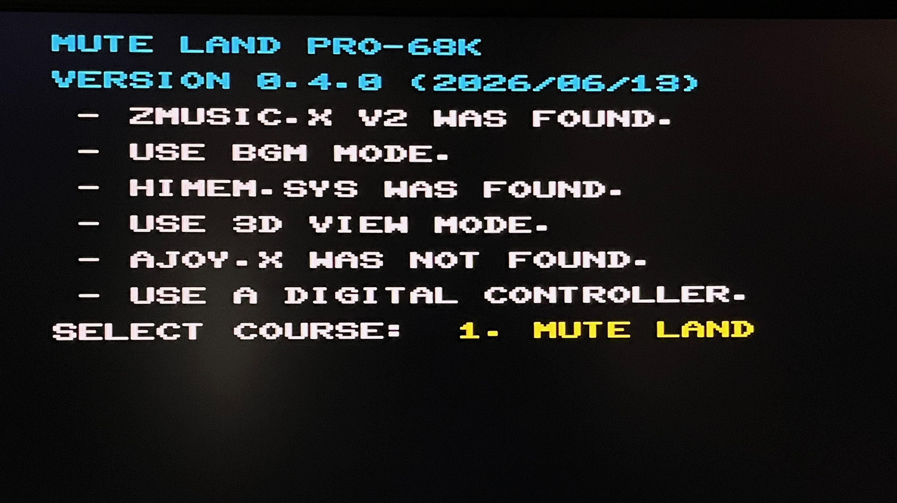
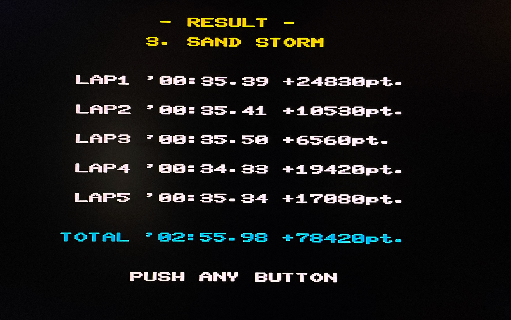
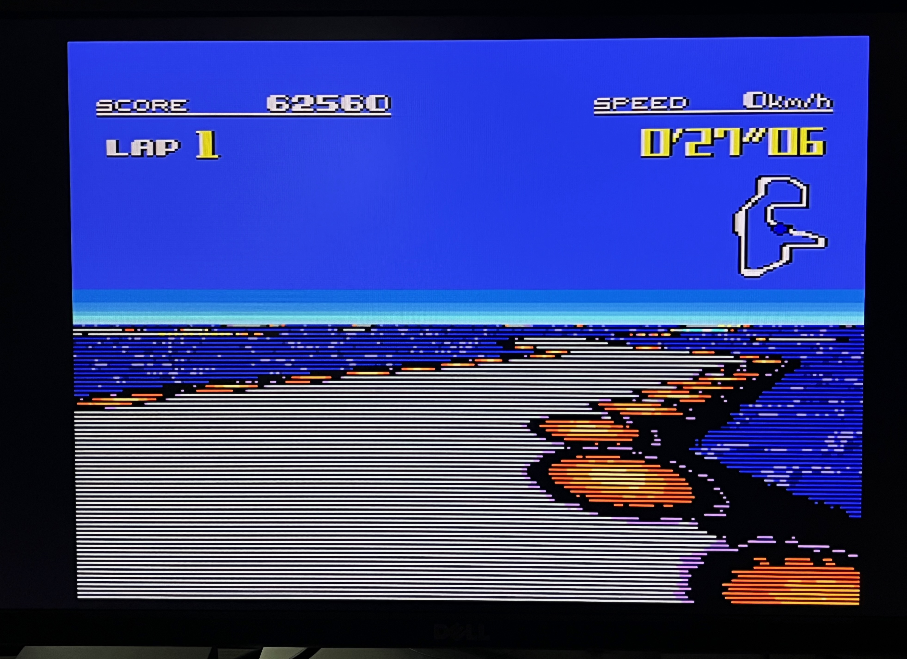
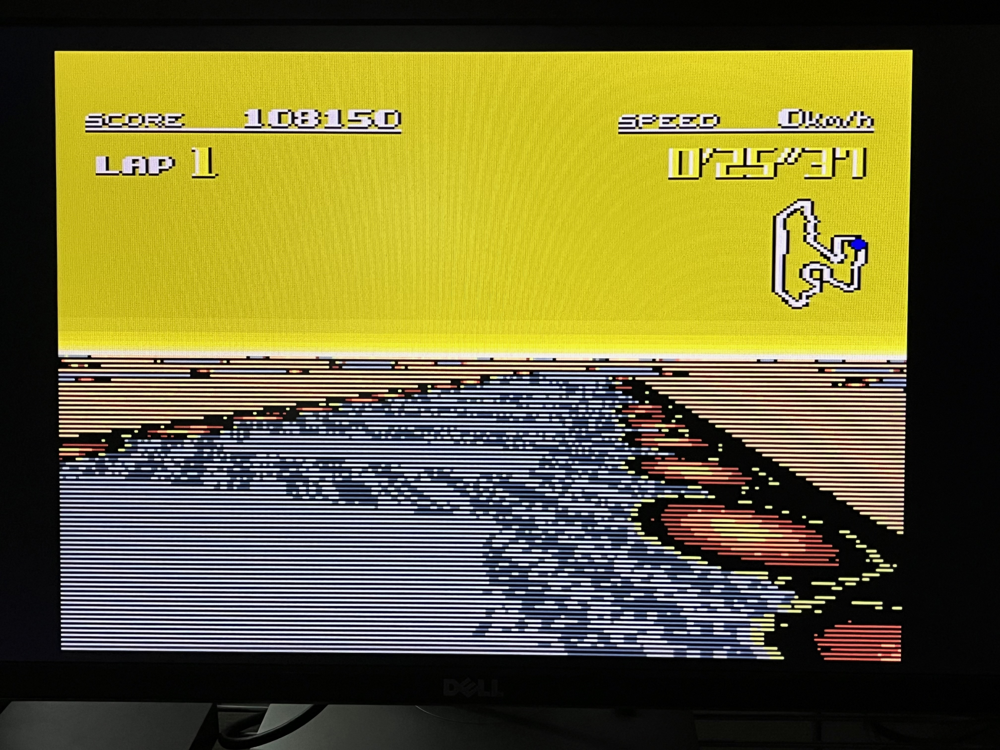
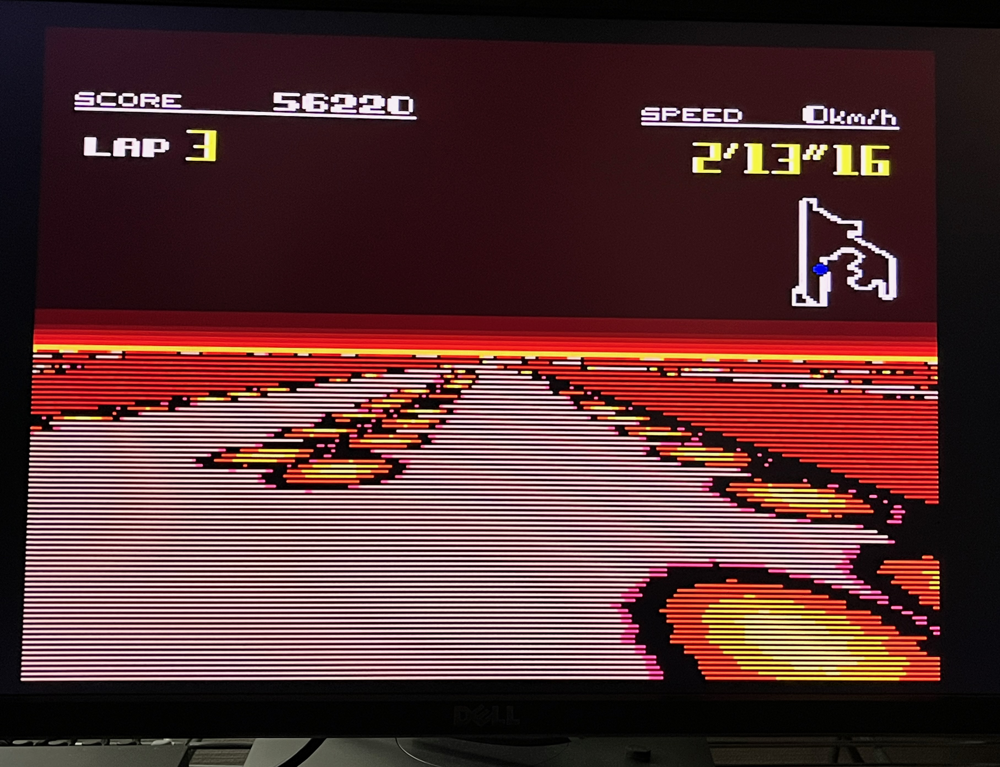
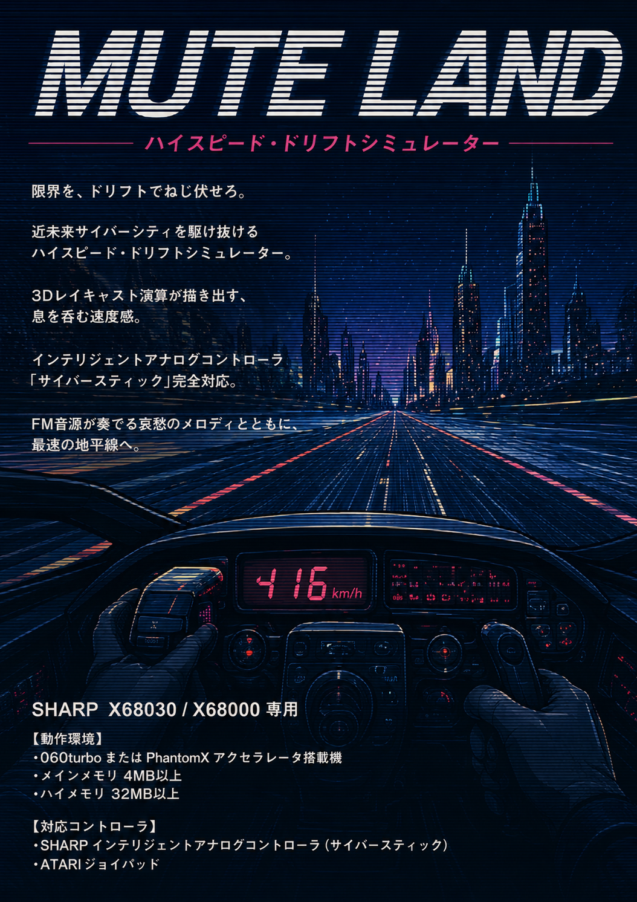

# MUTE LAND

A 3D cyber SF drift simulator for X680x0

---

## About This

ハイスピード・ドリフトシミュレータです。

 

X68030 + 060turbo または X68000 + PhantomX のいずれかで動作します。サイバースティックにも対応しています。

---

## 動作環境 (X68030 + 060turbo)

コピーバックモードを使用してください。(060turbo.sysに`-cm1`を指定)
ハイメモリが最低32MB必須です。

060コピーバックモードに対応したZMUSIC V2が必要です。

MZL氏によるパッチ版2.08eを使用してください。
- http://retropc.net/x68000/software/sound/zmusic/zmusic2/

サイバースティックを利用する場合は `AJOY.X` を常駐させます。HUYE氏による060対応パッチを適用してください。
- http://retropc.net/x68000/software/hardware/analog/ajoy/
- http://park7.wakwak.com/~huye/x68000_joy.html

---

## 動作環境(X68000 + PhantomX)

Pi4B + ライトバックモードを使用し、060turbo互換ハイメモリを有効にしてください。

はう氏のハイメモリドライバ TS16DRVp の常駐が必要です。
- https://haumea.x68kbbs.com/

サイバースティックを利用する場合は `AJOY.X` を常駐させます。
- http://retropc.net/x68000/software/hardware/analog/ajoy/

---

## JOYDRV3.X の利用について

サイバースティックを使う場合、`AJOY.X` 以外にも、HUYE氏の`JOYDRV3.X`を使用することも可能です。

`JOYDRV.CNF`設定例：

    DEVICE=2:\CYBERSTK.JOY
    SETMODE=0:2:0
    WAIT=2:0:300

なお、以下のようにすると背面JOYポートでサイバースティックを使うこともできます。フロントにはパッドを接続しておいて`JOYDRV3.X`を常駐するかどうかでどちらを使うか切り替えが可能です。

    DEVICE=2:\CYBERSTK.JOY
    SETMODE=0:2:1
    WAIT=2:1:300

---

## 遊び方

ZIPアーカイブファイルを展開し、`*.MTL`, `*.LUT`, `*.ZMD`, `MTLAND*.X` がカレントディレクトリにあることを確認します。

PhantomXの場合は `TS16DRVp.X` を常駐させます。

ZMUSIC V2 `ZMUSIC.X` を常駐させます。

サイバースティックを利用する場合は `AJOY.X` または `JOYDRV3.X` を常駐させます。

060turboの場合は`MTLAND060.X`、PhantomXの場合は`MTLAND.X`を起動します。

ゲームを起動すると、初期コース選択画面になります。3コースのうちどれか一つをレバーやパッド方向キーで選択し、ボタンを押すと決定になります。

コースデータのロードが終わると加速待ちの状態からスタートします。最初にスタートラインを切ったところからカウントが始まります。

サイバースティックの場合はスロットルを手前に引くとアクセル、奥に押し込むとブレーキです。

ジョイパッドの場合はボタンAがアクセル、ボタンBがブレーキです。

基本的にタイムアタックをするゲームではなく、いかにドリフトを深いアングルかつロングストロークで、コースからはみ出さないようにして決め、ポイントを稼ぐのが目的です。もちろんタイムを狙うのも自由です。

5ラップするとゴールでリザルトが表示されます。3コースすべて走り終わると総合ポイントが表示され、ゲーム終了となります。

---

## コース紹介

### 1. MUTE LAND

トワイライトの近未来都市ステージです。道幅も広く、練習にはうってつけです。裏ストレートエンドのシケインにあるデルタダートと縁石の隙間を狙ってみるのもよいでしょう。

### 2. BIG OCEAN

洋上に設置されたステージです。道幅が狭いため、ドリフトを決めるのは大変かもしれません。最終コーナーには水が乗っており、滑ります。

### 3. SAND STORM

砂漠ステージです。オリエンタルで哀愁あるBGMをバックに雰囲気を楽しんでみてください。ヘアピンはかなりの難所です。

### 4. FIRE FIGHT

火のステージです。ヘアピンやS字が多くかなりの難コースでドリフトどころではないかも...

---

## 開発環境

 - efl2x68k (Thanks to Yunkさん)
 - XEiJ (Thanks to M.Kamadaさん)

---

## 変更履歴

* 0.5.0 (2026/06/16) ... 4コース目追加
* 0.4.0 (2026/06/13) ... 初版

---

